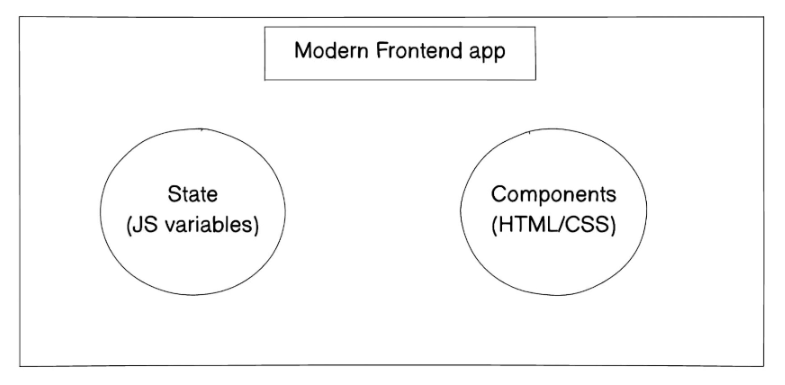

# Art of React Reconciliation: Unraveling the Magic Behind Efficient Component Updates

## Reconciliation

React and Vue both follow a process where they take updates to the application state and translate those updates into changes in the Document Object Model (DOM). This process involves actions like appending elements or removing them from the DOM to reflect the current state of the application.




## JavaScript Example

To illustrate the concept further, let's take a look at a JavaScript example that generates and displays todos with explanations:

```javascript
// Define a function to create and display todos based on data
function createTodo(data) {
    // Get the DOM element with the id "mainArea"
    var pastTodos = document.getElementById("mainArea");

    // Clear the existing content inside "mainArea"
    pastTodos.innerHTML = " ";

    // Loop through the data and create a new element for each item
    for (const element of data) {
        // Create a new <div> element and set its id attribute id could be automatically generated by the database that is element.id
        var childElement = document.createElement("div");
        childElement.setAttribute("id", element.id);

        // Create <span> elements to display title and description
        var grandChildElement1 = document.createElement("span");
        grandChildElement1.innerHTML = element.title;

        var grandChildElement2 = document.createElement("span");
        grandChildElement2.innerHTML = element.description;

        // Create a <button> element for deleting the todo
        var grandChildElement3 = document.createElement("button");
        grandChildElement3.innerHTML = "Delete";
        grandChildElement3.setAttribute("onclick", "deleteTodo('" + element.id + "')");

        // Append the <span> and <button> elements to the <div>
        childElement.appendChild(grandChildElement1);
        childElement.appendChild(grandChildElement2);
        childElement.appendChild(grandChildElement3);

        // Append the <div> to "mainArea"
        pastTodos.appendChild(childElement);
    }
}

// Periodically generate random todos and call createTodo function
window.setInterval(() => {
    let todos = [];

    // Generate a random number of todos
    for (let i = 0; i < Math.floor(Math.random() * 100); i++) {
        todos.push({
            title: "swaraj",
            description: "is a good boy"
        });
    }

    // Call createTodo with the generated todos
    createTodo(todos);
}, 2000);
```
In this example, we've provided a JavaScript function that creates and displays todos, simulating a simplified aspect of how React and Vue handle updates to the DOM to reflect changes in application state.

### HTML STRUCTURE

Here's the HTML structure used for the example:

```html
<!DOCTYPE html>
<html>

<head>
  <meta charset="utf-8">
  <meta name="viewport" content="width=device-width">
  <title>replit</title>
  <link href="style.css" rel="stylesheet" type="text/css" />
</head>

<body>
  <div id="mainArea"></div>
  <script src="script.js"></script>
  <script src="https://replit.com/public/js/replit-badge-v2.js" theme="dark" position="bottom-right"></script>
</body>
 
</html>

```
This HTML structure provides the necessary framework for the JavaScript code to run and display the generated todos in the "mainArea" div.
but this above code is _**not a good practice**_. since the whole data is deleted and then added again. which is not optimal and there is **_jitter_** where everything is deleted and then added again. so we need to do it in a better way.

_so basically developer has to only worry about the todo array how to get that, that is state the rest how it looks and how it is added and removed is done by the createTodo function. that is what react does. it takes the state, and then it does the rest of the work. here createTodo is acting like react library._ react updates the Dom according to the state or javascript input. we have to worry about what data should be given first and what it should be after how it will update is done by react.

so as we can see we are adding the data based on the input appending it and removing it we are only passing it to the function createTodo, and it is doing the rest of the work. this is reconciliation. Under the hood of React is does createElement, appendChild and removeChild. So framework like react and Vue hide this complexity from the developer and provide a simple interface to work with by just providing the state and the rest is done by the framework.

## Understanding Diffing Algorithm

In the previous section, we discussed how the initial code example updates the DOM by clearing existing content and re-adding elements, which is not an efficient approach. To improve this, we need to introduce the concept of a "Diffing Algorithm."The word is related to Difference.

### What is a Diffing Algorithm?

In the context of web development and libraries like React, a "Diffing Algorithm" is a crucial part of efficiently updating the Document Object Model (DOM) to reflect changes in the application's state.

At its core, the diffing algorithm is responsible for determining the difference between the current state of the application's user interface (UI) and the desired state. Once the differences are identified, it calculates the minimum number of operations required to transition from the current state to the desired state.

### How Diffing Works

1. **Virtual DOM**: React, for instance, employs a Virtual DOM (VDOM) to represent the UI as a lightweight in-memory data structure. The VDOM is essentially a snapshot of the UI's state at a particular moment.

2. **Reconciliation**: When changes occur in the application's state, React generates a new VDOM representing the updated state.

3. **Diffing Phase**: React then initiates the diffing algorithm, comparing the old VDOM with the new VDOM to identify differences. It checks which components have changed, which have been added or removed, and what attributes or content have been updated.

4. **Update Operations**: Once differences are identified, React calculates the most efficient way to update the actual DOM to match the new VDOM. It generates a set of update operations, such as adding, modifying, or removing specific elements, and applies them to the real DOM.

5. **Minimal Updates**: One key feature of the diffing algorithm is that it strives to minimize the number of DOM updates. Instead of recreating the entire UI, it only updates the parts that have changed, resulting in better performance.

### Benefits of Diffing Algorithm

- **Efficiency**: The diffing algorithm reduces unnecessary updates to the DOM, making UI updates more efficient, especially in complex applications.

- **Performance**: By minimizing the number of DOM operations, it ensures that changes in the UI are reflected swiftly, leading to a smoother user experience.

- **Optimization**: Developers can focus on updating the application's state, while the diffing algorithm handles the details of how to update the UI efficiently.

In our example, we initially cleared and recreated the entire list of todos when updates occurred. By understanding and implementing a diffing algorithm similar to what libraries like React use, we can significantly improve the performance and user experience of our application.


```javascript
function createDomElements(data) {
    // mainArea is the parent element
  var parentElement = document.getElementById("mainArea");

  // Get the current children of the parent element and convert it to an array
  var currentChildren = Array.from(parentElement.children);    //initially it will be empty array
  console.log(currentChildren);

  let added = 0,
    deleted = 0,
    updated = 0;
  // Process each item in the data array
  data.forEach(function (item) {
    // Check if a child with this ID already exists
    var existingChild = currentChildren.find(function (child) {
      return child.dataset.id === String(item.id);
    });

    if (existingChild) {
      updated++;
      // If it exists, update it
      existingChild.children[0].innerHTML = item.title;
      existingChild.children[1].innerHTML = item.description;
      // Remove it from the currentChildren array
      currentChildren = currentChildren.filter(function (child) {
        return child !== existingChild;
      });
    } else {
      added++;
      // If it doesn't exist, create it
      var childElement = document.createElement("div");
      childElement.dataset.id = item.id; // Store the ID on the element for future lookups

      var grandChildElement1 = document.createElement("span");
      grandChildElement1.innerHTML = item.title;

      var grandChildElement2 = document.createElement("span");
      grandChildElement2.innerHTML = item.description;

      var grandChildElement3 = document.createElement("button");
      grandChildElement3.innerHTML = "Delete";
      grandChildElement3.setAttribute("onclick", "deleteTodo(" + item.id + ")");

      childElement.appendChild(grandChildElement1);
      childElement.appendChild(grandChildElement2);
      childElement.appendChild(grandChildElement3);
      parentElement.appendChild(childElement);
    }
  });

  // Any children left in the currentChildren array no longer exist in the data, so remove them that is of previous state or DOM
  currentChildren.forEach(function (child) {
    deleted++;
    parentElement.removeChild(child);
  });

  console.log(added);
  console.log(updated);
  console.log(deleted);
}

window.setInterval(() => {
  let todos = [];
  for (let i = 0; i < Math.floor(Math.random() * 100); i++) {
    todos.push({
      title: "Go to gym",
      description: "Go to gym form 5",
      id: i + 1,
    });
  }

  createDomElements(todos);
}, 5000);

```

In the above example we are checking if the element with same id exists or not already. if it doesn't then we add it in the DOM else we only update that element and not re-render everything.

we give reconciler a state and according to that state it will render the component
a state can be in memory like a variable or in a database a array of objects
we give for example [{name: 'john', age: 20}, {name: 'jane', age: 30}] to the reconciler and second parameter as a function that will render the component according to the state.

### Virtual DOM (VDOM)
VDOM is the virtual representation of the DOM in a tree like complex data structure.
VDOM can be explained as array or object that contains the info about the component not in DOM format but in state varible format string, int, array, object etc. it is called virtual dom because it is a copy of component not in a heavy DOM format but in a light state format or lean format.
it is needed because as our frontend starts to get complicated as we do need vdom. it is a in memory representation of the DOM. it needs to do difference between the old and new vdom and then it will update the DOM. like finding the difference between current state and vdom and then update the DOM
and also updates the VDOM. VDom is like a global variable that is always updated and always in sync with the DOM.

### Benfifts of VDOM:
beacause at any point vdom is the current representation of the DOM we can use it to do other things like batching.
let say its a complex front end and too many state changes are happening then we can use vdom to batch the changes and then update the DOM. so instead of updating the DOM 100 times we can update it once.
// imp point: vdom batch if there are many quick changes to the state let say it returns to the existing state then it will not update the DOM. it will only update the DOM if there is a change in the state. so if there are many quick changes to the state it will only update the DOM once. so it is very efficient.

State is what our apps currently looks like in a variable like array or a string etc.
Components are independent and reusable bits of code. They serve the same purpose as JavaScript functions, but work in isolation and return HTML.or how the app should look.

```javascript

// Initialize an empty array to represent the virtual DOM
let vDOM = [];

// Function to create or update DOM elements based on the virtual DOM changes
function createDomElements(existingDOM, currentDOM) {
    // Get the parent element in the actual DOM where the changes will be made
    var parentElement = document.getElementById("mainArea");

    // Initialize counters to track added, deleted, and updated elements
    let added = 0, deleted = 0, updated = 0;

    // Loop through each item in the current virtual DOM
    currentDOM.forEach(function(item) {
        // Check if an element with this ID already exists in the old virtual DOM
        var existingItem = existingDOM.find(function(oldItem) {
            return oldItem.id === item.id;
        });

        if (existingItem) {
            updated++;
            // If it exists, update its content in the actual DOM
            var existingChild = document.querySelector(`[data-id='${item.id}']`);
            existingChild.children[0].innerHTML = item.title;
            existingChild.children[1].innerHTML = item.description;
        } else {
            added++;
            // If it doesn't exist in the DOM, create a new element
            var childElement = document.createElement("div");
            childElement.dataset.id = item.id; // Store the ID on the element for future lookups

            var grandChildElement1 = document.createElement("span");
            grandChildElement1.innerHTML = item.title;

            var grandChildElement2 = document.createElement("span");
            grandChildElement2.innerHTML = item.description;

            var grandChildElement3 = document.createElement("button");
            grandChildElement3.innerHTML = "Delete";
            grandChildElement3.setAttribute("onclick", "deleteTodo(" + item.id + ")");

            // Append the child elements to the parent element in the actual DOM
            childElement.appendChild(grandChildElement1);
            childElement.appendChild(grandChildElement2);
            childElement.appendChild(grandChildElement3);
            parentElement.appendChild(childElement);
        }
    });

    // Remove any items in the actual DOM that no longer exist in the virtual DOM
    existingDOM.forEach(function(oldItem) {
        if (!currentDOM.some(item => item.id === oldItem.id)) {
            deleted++;
            var childToRemove = document.querySelector(`[data-id='${oldItem.id}']`);
            parentElement.removeChild(childToRemove);
        }
    });

    // Log the counts of added, updated, and deleted elements
    console.log("Added: " + added);
    console.log("Updated: " + updated);
    console.log("Deleted: " + deleted);
}

// Function to update the virtual DOM with new data and trigger DOM updates
function updateVirtualDom(data) {
    // Create a copy of the existing virtual DOM to track changes
    let existingDOM = [...vDOM];

    // Update the virtual DOM with the new data
    vDOM = data.map(item => {
        return {
            id: item.id,
            title: item.title,
            description: item.description
        };
    });

    // Pass the old and new virtual DOM to the createDomElements function for updates
    createDomElements(existingDOM, vDOM);
}

// Periodically update the virtual DOM with random data every 5 seconds
window.setInterval(() => {
    let todos = [];
    for (let i = 0; i < Math.floor(Math.random() * 100); i++) {
        todos.push({
            title: "Go to gym",
            description: "Go to gym from 5",
            id: i + 1
        });
    }

    // Call the updateVirtualDom function with the new data
    updateVirtualDom(todos);
}, 5000);

```
In the above case we are not using children since it is an expensive operation instead we keep a copy of existing DOM or previous DOM and send it as a parameter to the createDomElements function with the new or current DOM that means we send the state directly instead of fetching it in the function which makes the function more reusable and efficient. and then we compare the two DOMs and update the DOM accordingly.
To a reconciler in react at the start we give state and component after that we only update the state and reconciler will update the component according to the state.

### Batch Updates
Batching is a process of combining multiple updates into a single update. This is done to improve performance and reduce the number of DOM updates. React uses batching to update the DOM. It batches all the updates that occur within a single event loop and then updates the DOM at the end of the event loop. This is done to avoid unnecessary DOM updates.

```javascript

let vDOM = []; // Our initial vDOM is an empty array

function createDomElements() {
  var parentElement = document.getElementById("mainArea");

  var currentChildren = Array.from(parentElement.children);

  let added = 0, deleted = 0, updated = 0;
  // Now, we'll compare our new vDOM to our actual DOM
  vDOM.forEach(function(item) {
    // Check if a child with this ID already exists in the DOM
    var existingChild = currentChildren.find(function(child) {
      return child.dataset.id === String(item.id);
    });

    if (existingChild) {
      updated++;
      // If it exists, update it
      existingChild.children[0].innerHTML = item.title;
      existingChild.children[1].innerHTML = item.description;
      // Remove it from the currentChildren array
      currentChildren = currentChildren.filter(function(child) {
        return child !== existingChild;
      });
    } else {
      added++;
      // If it doesn't exist in the DOM, create it
      var childElement = document.createElement("div");
      childElement.dataset.id = item.id; // Store the ID on the element for future lookups

      var grandChildElement1 = document.createElement("span");
      grandChildElement1.innerHTML = item.title;

      var grandChildElement2 = document.createElement("span");
      grandChildElement2.innerHTML = item.description;

      var grandChildElement3 = document.createElement("button");
      grandChildElement3.innerHTML = "Delete";
      grandChildElement3.setAttribute("onclick", "deleteTodo(" + item.id + ")");

      childElement.appendChild(grandChildElement1);
      childElement.appendChild(grandChildElement2);
      childElement.appendChild(grandChildElement3);
      parentElement.appendChild(childElement);
    }
  });

  // Any children left in the currentChildren array no longer exist in the data, so remove them
  currentChildren.forEach(function(child) {
    deleted++;
    parentElement.removeChild(child);
  });

  console.log(added);
  console.log(updated);
  console.log(deleted);
}


function updateVirtualDom(data) {
    vDOM = data.map(item => {
        return {
          id: item.id,
          title: item.title,
          description: item.description
        };
      });
}
window.setInterval(() => {
    let todos = [];
    for (let i = 0; i<Math.floor(Math.random() * 100); i++) {
      todos.push({
        title: "Go to gym",
        description: "Go to gym from 5",
        id: i+1
      })
    }
  
    updateVirtualDom(todos);
  }, 100);

window.setInterval(() => {
    createDomElements();
}, 1000);

```

### Conclusion
In the world of web development, understanding the magic behind React's reconciliation process and the diffing algorithm is key to building efficient and responsive user interfaces. By leveraging the power of the Virtual DOM and implementing a diffing algorithm, you can significantly improve the performance and user experience of your applications.

Remember that React's reconciler takes care of the heavy lifting for you. You provide the state, and it handles the DOM updates efficiently. Embrace these concepts, and your front-end development journey will be smoother and more enjoyable.

Reconciliation is an art, and with practice, you can master it to create exceptional user experiences.
